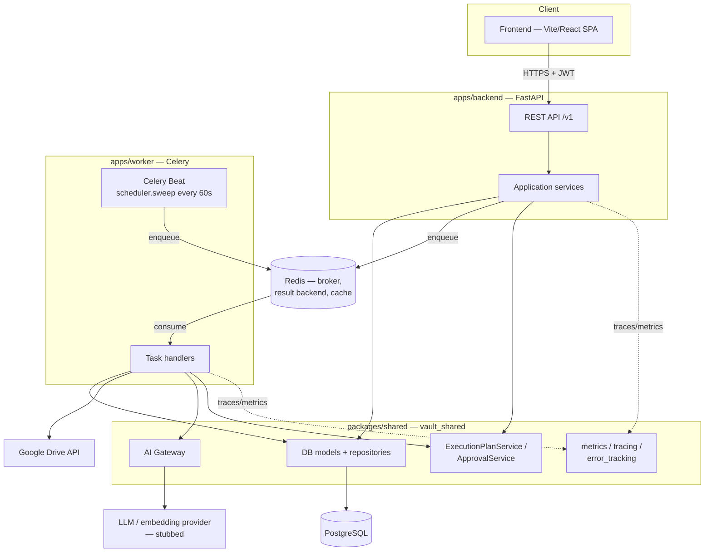

# 06 — Architecture Documentation

Status: **Reference document**, introduced in Phase 10. This is the system-level view: what talks to what, and why. For engineering standards and *how* to build within this architecture, see the [Engineering Handbook](00_ENGINEERING_HANDBOOK.md). For *why* a specific structural decision was made, see the [ADR log](03_ARCHITECTURE_DECISIONS.md) — this document points to the relevant ADR rather than re-litigating each decision.

---

## 1. System diagram



## 2. Layer boundaries (Handbook §6)

Every app follows the same four layers: **presentation** (HTTP/task-entry — translates transport concerns into calls on the application layer, never contains business logic), **application** (orchestration, one service class per bounded capability — e.g. `ScanService`, `ApprovalService`), **domain** (pure business rules, no I/O), **infrastructure** (DB session, queue clients, external API clients). `packages/shared` mirrors this for anything both apps need identically.

**Verified boundary checks (Phase 10 architecture review):**
- No `apps/backend` code imports from `apps/worker`, or vice versa — the only channel between them is Celery task names (`app/infrastructure/queue/*_producer.py` → `worker/tasks/*.py`, matched by string, not import) and correlation-ID headers (ADR-022).
- `app/core/error_handlers.py` is the only place an exception becomes an HTTP status code — every service raises typed `vault_shared` errors (`NotFoundError`, `ForbiddenError`, etc.), never constructs an HTTP response itself.
- No provider SDK (Google's `google-auth`, an LLM SDK, `sentry-sdk`'s provider-specific integrations) is imported outside its designated adapter module — verified by `grep`-auditing import statements against the AI Gateway boundary (§3 below) and the connector OAuth client.

## 3. The AI Gateway boundary (Handbook §8.14, ADR-018, ADR-022)

`vault_shared.ai_gateway.AIGateway` is the **only** place either app calls an embedding or completion provider. Every caller — `EmbeddingService` (worker), `SearchService`/`ConversationService` (backend) — calls `AIGateway.embed()`/`.complete()` and knows nothing about which provider is behind it. Swapping providers is a change to `get_ai_gateway()`'s factory plus a new adapter class implementing `EmbeddingProvider`/`CompletionProvider` — zero changes to any caller. As of Phase 10, every `embed()`/`complete()` call is also timed and recorded via `vault_shared.metrics.record_ai_provider_latency`, inside the gateway itself — instrumentation lives at the boundary, not scattered across every call site.

Current providers: `LocalEmbeddingProvider` (gensim + pretrained GloVe, free/offline — ADR-018 explains why, not a transformer model) and a stubbed completion provider (deterministic, never invents an answer — a real LLM provider is a founder decision not yet made, same pattern as ADR-021's email stub).

## 4. The Connector Platform boundary (Handbook §8.1, ADR-014)

Google Workspace is the first storage connector, not the only one the architecture assumes. `StorageConnector`/`ConnectorCredentials` (packages/shared) and `GoogleWorkspaceOAuthClient` are the abstraction — the scanner (`worker/scanner/`), execution engine (`worker/execution/`), and every service that reads inventory (`FileService`, `DashboardService`, etc.) work against the `StorageConnector` model and repositories, never against a Google-specific type. A second connector (SharePoint, Dropbox, S3) would add a new OAuth client + a new adapter implementing the same read/write contract, not touch the scanner or execution engine's own logic.

## 5. Data flow through the pipeline (Phases 3-9)

```text
Connect (OAuth)  →  Scan (inventory)  →  Enrich (classify/extract/relate)  →  Embed (vectorize)
     ↓                                                                              ↓
Connector Platform                                                          Recommendation Engine
                                                                                     ↓
                                                                          Execution Plan → Approval
                                                                                     ↓
                                                                          Execution (mutates Drive)
```

Each stage auto-chains into the next on completion (`worker/tasks/*.py`'s `_enqueue_*_if_*_completed` helpers) — a founder triggers a scan once; enrichment, embedding, and recommendation generation happen automatically. Automation (Phase 9) adds a parallel path: a workflow's `EXECUTE_ACTION` node can build a plan and (per a published policy) auto-decide its own approval — but every automated decision still produces the identical `ApprovalDecision`/`ExecutionJob`/audit trail a human's click would (ADR-021). Nothing skips the Approval System; automation is a second kind of approver, not a bypass.

## 6. Cross-cutting concerns (Phase 10, ADR-022)

| Concern | Where it lives | Stub-until-configured? |
|---|---|---|
| Structured logging | `vault_shared.logging` — JSON, `request_id`/`task_id` context vars | No — always on |
| Metrics | `vault_shared.metrics` — Prometheus counters/histograms | No — always on |
| Tracing | `vault_shared.tracing` — OpenTelemetry | Yes — `OTEL_EXPORTER_OTLP_ENDPOINT` |
| Error tracking | `vault_shared.error_tracking` — Sentry | Yes — `SENTRY_DSN` |
| Rate limiting | `app/presentation/dependencies/rate_limit.py` | No — fails open on Redis outage, not "off" |
| Security headers | `app/core/security_headers_middleware.py` | No — always on |
| Response caching | `app/infrastructure/cache/response_cache.py` | No — fails open on Redis outage |

## 7. No circular dependencies

Verified two ways this phase: (1) Python import-level — neither app imports the other, `packages/shared` imports nothing from either app; (2) Terraform module-level — the `infrastructure/terraform` module graph was found to have a real cycle during this phase's own development (`compute` → `secrets` → `database`/`redis` → `compute`) and fixed by moving the shared security group into the `network` module — see ADR-022 for the full story and how it was caught (`terraform validate`, not manual review).

## 8. Documentation matches implementation

This document, the [API Documentation](05_API_DOCUMENTATION.md), and the [Database Documentation](07_DATABASE_DOCUMENTATION.md) were written by reading the actual code as it exists after Phase 10, not from memory of what earlier phases intended — the endpoint counts and table lists in each were generated by scripting against the real router/model files, not hand-counted, specifically to avoid documentation drift (see the Phase 10 [Release Readiness Report](phases/PHASE_10_COMPLETION_REPORT.md) for how a first hand-estimated endpoint count was caught wrong and corrected this same way).
